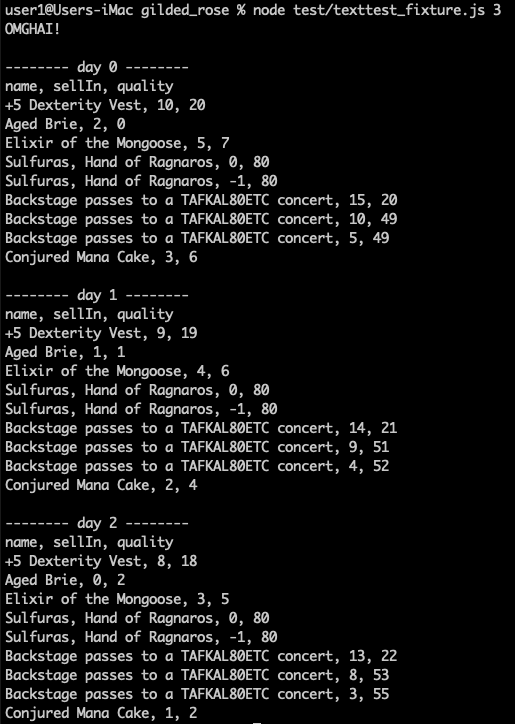
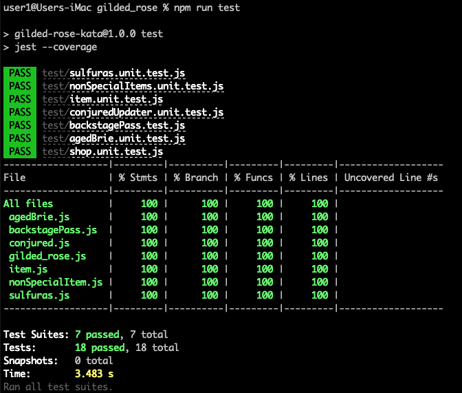

# Gilded Rose

## The Task
"Hi and welcome to team Gilded Rose. As you know, we are a small inn with a prime location in a prominent city run by a friendly innkeeper named Allison. We also buy and sell only the finest goods. Unfortunately, our goods are constantly degrading in quality as they approach their sell by date. We have a system in place that updates our inventory for us. It was developed by a no-nonsense type named Leeroy, who has moved on to new adventures. Your task is to add the new feature to our system so that we can begin selling a new category of items. First an introduction to our system:

All items have a SellIn value which denotes the number of days we have to sell the item. All items have a Quality value which denotes how valuable the item is. At the end of each day our system lowers both values for every item. Pretty simple, right? Well this is where it gets interesting:

Once the sell by date has passed, Quality degrades twice as fast
The Quality of an item is never negative
“Aged Brie” actually increases in Quality the older it gets
The Quality of an item is never more than 50
“Sulfuras”, being a legendary item, never has to be sold or decreases in Quality
“Backstage passes”, like aged brie, increases in Quality as it’s SellIn value approaches; Quality increases by 2 when there are 10 days or less and by 3 when there are 5 days or less but Quality drops to 0 after the concert
We have recently signed a supplier of conjured items. This requires an update to our system:

“Conjured” items degrade in Quality twice as fast as normal items
Feel free to make any changes to the UpdateQuality method and add any new code as long as everything still works correctly. However, do not alter the Item class or Items property as those belong to the goblin in the corner who will insta-rage and one-shot you as he doesn’t believe in shared code ownership (you can make the UpdateQuality method and Items property static if you like, we’ll cover for you)."

## Getting started

Install dependencies

```sh
npm install
```

## Running the App
To see the app functioning:
```
Clone this repo.

$ node test/texttest_fixture.js (number of days you'd like to simulate)
```

You should see the app prints out the example stock with the updated values for each day


## Running tests

To run all tests with coverage built in

```sh
npm test
```

To run all tests in watch mode

```sh
npm run test:watch
```

Running npm test you should see 100% code coverage and 18 out of 18 tests passing


## My Approach
First things first I needed to refactor the code using TDD as it features up to 5 if statements inside each other. The best way to break this down is into a series of seperate functions that each deal with a specific item. This way it should be clearer to add in the new *conjured* items category.

Once I got my code up and running with the items (excluding conjured) I needed to further refactor as I wanted it to be as easy as possible to add a new category. So far the updateQuality function has a little logic as possible and uses a series of private functions to execute the altering of quality and sellIn values. But to determine what function runs that is in an if statement that could be made more readable. 

## Planning
### Items
Items already in stock:
- [ ] "Aged Brie"
- [ ] "Sulfuras"
- [ ] "Backstage Passes"

Items to be added later:
- [ ] "Conjured"

### Depreciation
- [ ] max quality quality value is 50
- [ ] "Aged Brie" quality value increases
- [ ] "Sulfuras" does not depreciate
- [ ] "Backstage passes" increase by 1 when > 10 days left : increase by 2 when < 10 days : increase by 3 < 5 days : value of 0 when < 0 days
- [ ] "Conjured" items depreciate twice as fast as normal
- [ ] All other items depreciate by 1 per day

### Refactoring updateQuality()
update Quality was initially a giant if statement so I wanted to break it down to see was being returned at each step.
```
First statement:
> if item is not brie, not backstage pass, not sulfras, item quality > 0
=> Item quality - 1

Else:
> if item quality < 50 
=> quality + 1 
> if item is a backstage pass, if item sellIn < 11, if quality < 50
  => quality + 1
  > if the sellIn < 6, if quality < 50
  => quality + 1

Second statement:
> if item is not a sulfra
=>  quality - 1

Third statement:
> if sellIn < 0, item is not brie, item is not backstage pass, quality > 0, item is not Sulfuras
=> quality - 1

Else:
=> quality = 0

Else:
> if item quality < 50
=> quality + 1
```

### Key Words
- 'Aged Brie'
- 'Sulfuras'
- 'Backstage pass'
- 'Conjured'
- anything else should have the default of -1 quality

### Desired Output
-------- day 2 --------
name, sellIn, quality
+5 Dexterity Vest, 8, 18
Aged Brie, 0, 2

### Classes
- Item. This should contain the details of a singular item (the name, the sellIn days, and the quality value)
- Shop. This should contain the array of items that are held in the shop. As well as currently updates the items to the new price at the end of the day
- Each special item should have it's own class and be an **extension of Item** so it can inherit the constructor values but have a different updateQuality values for each. 

## Code Layout
Initially I wanted to touch Item as little as possible so I created classes that just updated the quality of whatever the Item was however this felt quite inefficient and ended up with lots of code being repeated and poor readability. To overcome this I redesigned the way data was inputted by creating classes for each special item that inherited the constructor from Item but gave them all an updateQuality function. This meant that I could run the updateQuality() once and it would update every single class instance. This meant the code was DRY and gave each class a single responsibility. 

## What could be improved
Next steps:
- the user has to input with the class name for each item. I wonder if you could input the data for Item and it could then auto be passed into the correct class to make the use of the app easier on the users end.
- the print statement is quite hard to read so a formatted table would be a good thing to add. 
